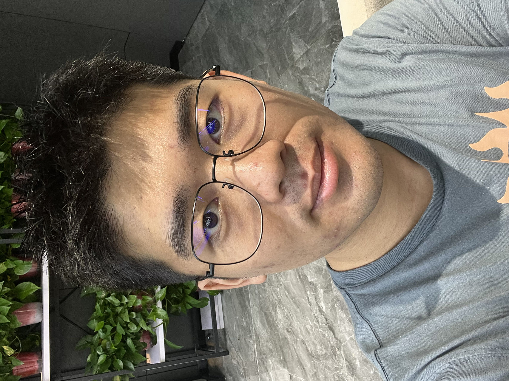

PhD student of Biostatistics  
The University of Texas Health Science Center at Houston

 

 

### Research
I have learned cure rate model by subgroup analysis. I also have worked to linear mixed model and contributed an article to a known ACM conference. Recently, I studied about graph neural network by self, implemented some classical models and had some new ideas. I'm interested and enthusiastic to do further study on statistics and machine learning. I am looking for opportunities for research. [Here](documents/CV_Baode GAO.pdf) is my CV.

### About
I got my bachelor's degree in applied mathematics from [XJTLU](https://www.xjtlu.edu.cn/en/) in 2020 and MS's degree in Biostatistics from [Columbia University](https://www.columbia.edu/). I am currently a first year PhD student in Biostatistics & Data Science, [UTHealth](https://www.uth.edu/). 
 

### Contact Information

Baode Gao  
[Department of Biostatistics & Data Science](https://sph.uth.edu/dept/bads/)  
[School of Public Health](https://sph.uth.edu/campuses/houston)  
7900 Cambridge St  
Houston, Texas 77054  

Email: [bg2715@caa.columbia.edu](mailto:bg2715@caa.columbia.edu) 