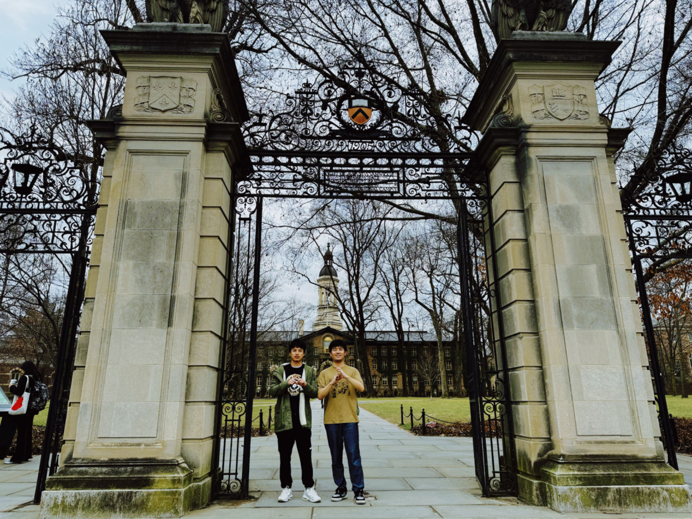

### 2/23/2024 
PhD student of Biostatistics and Data Science  
The University of Texas Health Science Center at Houston

 

 

### Research
I possesses a strong foundation in mathematics and statistics, with expertise in statistical techniques for subgroup analysis within the cure rate model, and recommendation systems. I holds a keen interest in machine learning methodologies and gained exposure to fMRI data during his involvement in a machine learning method development program at Irving Medical Center. Additionally, I has practical experience in transfer learning applied to CT scans for infection detection and employing masked token transformer techniques on audio spectrograms. I'm interested and enthusiastic to do further study on machine learning and causal learning. I am looking for opportunities for research. [Here](documents/CV_Baode GAO_2_22_2024.pdf) is my CV.

### About
I got my bachelor's degree in applied mathematics from [XJTLU](https://www.xjtlu.edu.cn/en/) in 2020 and MS's degree in Biostatistics from [Columbia University](https://www.columbia.edu/) in 2023. I am currently a first year PhD student in Biostatistics & Data Science, [UTHealth](https://www.uth.edu/). 
 

### Contact Information

Baode Gao  
[Department of Biostatistics & Data Science](https://sph.uth.edu/dept/bads/)  
School of Public Health, [The University of Texas Health Science Center at Houston](https://www.uth.edu/)  
[Functional Data Analysis Working Group](https://www.publichealth.columbia.edu/research/programs/functional-data-analysis-working-group) & Causal Deep Learning Journal Club  
7900 Cambridge St  
Houston, Texas 77054  

Email: [bg2715@caa.columbia.edu](mailto:bg2715@caa.columbia.edu) 